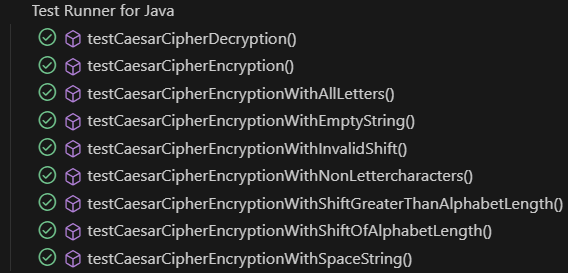

# StringCryption Library
# version 1.0.0

## Introduction

The `StringCryption` library is intended to provide a comprehensive suite of methods for encrypting and decrypting strings at various levels of complexity. Designed with flexibility in mind, this library allows users to choose from multiple encryption levels, each offering a different degree of complexity.

The library is now at its first release and there are known issues and conflicts present that will be resolved in future versions. Not to say that the library is unsafe to use, the known conflicts and issues are worked around and the lib is well tested to avoid side-effects.

## Unique Selling Points (USP)

- **Multiple Encryption Levels:** Choose from different levels of encryption complexity, ranging from simple to highly complex algorithms.
- **Ease of Use:** Simple and intuitive API that makes it easy to integrate encryption and decryption functionalities into your projects.
- **Customizable:** The user can either download the .jar file to simply use the implemented interface or clone the entire project and discover their own customization.
- **Comprehensive String Manipulation:** Includes additional string manipulation methods like reversing, duplicating, rotating characters, and swapping cases.
- **More to come** future iterations will add more options to expand the customization, security and flexibility.

## How to Use

### Option 1: Clone the Entire Project

1. **Navigate to Your Desired Directory:**
  - Open a terminal and navigate to the directory where you want to clone the repository. For example:
  ```sh
  cd path/to/your/desired/directory
  ```

2. **Clone the Repository:**
  - Press the `<> Code` button in the GitHub repository and copy the URL.
  - Or Use the following command to clone the repository:
  ```sh
  git clone https://github.com/Letssdothiss/610-L2.git
  ```

3. **Navigate to the Cloned Repository:**
  - Change the directory to the cloned repository:
  ```sh
  cd 610-L2
  ```

4. **Use the JAR File:**
   - The `StringCryption.jar` file is already included in the cloned repository. You can directly add it to your project as described in option 2.

### Option 2: Download the JAR File

1. **Download the JAR File:**
   - Download the `StringCryption.jar` file from the releases section or directly from the repository.

2. **Add the JAR File to Your Project:**

#### Using an IDE

- **IntelliJ IDEA:**
  - Follow the instructions in the [IntelliJ IDEA documentation](https://www.jetbrains.com/help/idea/library.html#add-library).

- **Eclipse:**
  - Follow the instructions in the [Eclipse documentation](https://help.eclipse.org/latest/index.jsp).
  - Search for ´SWT Java Project Wizard´ and click on the topic that matches the search query.(For some reason the direct link wont load the proper page.)

- **Visual Studio Code(VS code):**
  - Follow the instructions in the [VS Code documentation](https://code.visualstudio.com/docs/java/java-project#_working-with-jar-files).

#### Using the Command Line

1. **Compile Your Project with the JAR File:**
   - Ensure the `StringCryption.jar` file is in your project's directory.
   - Compile your project with the JAR file in the classpath.
   ```sh
   javac -cp .;StringCryption.jar YourMainClass.java
   ```

2. **Run Your Project with the JAR File:**
   - Run your project with the JAR file in the classpath.
   ```sh
   java -cp .;StringCryption.jar YourMainClass
   ```

### 3. Using the library in your code
   - Import the StringCryption class and use its methods in your code.

```java
import main.java.stringCryption.StringCryption;

public class YourMainClass {
  public static void main(String[] args) {
    StringCryption stringCryption = new StringCryption();

    String exampleInput = "The string to encrypt."
    int exampleLevel = 3 // A number between 1-5 in current implementation.

    // Encrypting a string.
    String encryptedInput = stringCryption.encryptAtChosenLevel(exampleInput, exampleLevel)
    System.out.println("Encrypted Input: " + encryptedInput)

    // Decrypting a string
    String decryptedInput = stringCryption.decryptAtChosenLevel(encryptedInput, exampleLevel)
    System.out.println("Decrypted Input: " + decrypted)
  }
}
```
#### Methods in the public interface
   - The public interface contains two usable methods which can result in five different outcomes each.

### `public String encryptAtChosenLevel(String input, int levelOfEncryption)`
   - Description: This method takes a string to encrypt as its first arguemnt and the second is a choice of 1-5 to which level the desired encryption should be. Where one is the least complex and five is the most complex encryption.
   - Returns: It returns the input string but encrypted to the chosen level.

### `public String decryptAtChosenLevel(String encryptedInput, int levelOfDecryption)`
   - Description: This method takes an encrypted string as its first argument and an integer between 1-5 as its second argument. There are two conditions that need to be met for the decryption to be successful, the encrypted string must be a returned string from the encryptAtChosenLevel() method and the decryption level must be the same level used to encrypt the original input. 
   - Returns: The decrypted string, original input.


#### Notes
   - Make sure to enter a valid encryption level (1-5 in current implementation.)
   - The same level of encryption used on an input have to be used when decrypting, else the result wont be the same.
   - If these five options are not enough, the option to create custom methods for encryption is possible if the project is cloned.

## Test Report

The following images are the results of the automated testing performed for the `StringCryption` library.

#### StringManipulator class


#### Salt class


#### EncryptionCipher class



#### Encryption class


#### StringCryption class


## Issues and bugs

### Issues

#### vowelTosymbol & undoVowelToSymbol
   - These two methods will cause issues if used on a string which has been salted first. Either direction the methods are used, if both are used on a salted string, the output will either be more or less of either symbols or vowels. This is because the salt encryption adds both letters(vowels) and symbols, this will most likely interfere with the vowel-to-symbol conversion.

#### stringToCamelCase & undoStringToCamelCase 
   - The stringToCamelCase method correctly transforms a string to camel case, but the undoStringToCamelCase method only creates a readable string with spaces between words.  It does not guarantee that the original string will be restored exactly as it was before the camel case conversion.

### Potential bugs

#### Duplicate String and Rotate Characters
   - If you duplicate a string and then rotate the characters, the undo methods must be called in the exact reverse order with the correct parameters to restore the original string. Any deviation in the order or parameters can result in an incorrect output.

#### Swap Case and Insert Phrase
   - If you swap the case of a string and then insert a phrase, the undo methods must be called in the exact reverse order to restore the original string. Any deviation in the order can result in an incorrect output.

## Reflections

### Naming

| Naming & explanation | Reflection & rules from Clean Code |
|-----------------|-----------------|
| `StringCryption` This is the name of the main class in the library/module, the public interface. | **Class Names:** Class names should be nouns or noun phrases. <br> **Use Pronouncable names:** Even though i am now realizing that im breaking the rule of `Dont be cute`, this class name reads quite well. |
| `encryptAtChosenLevel` This is the name of the method that chooses encryption algorithm based on the user selected level (Second parameter, number between 1-5). |  **Method Names:** Method names should be verbs or verb phrases. <br> **Use Intention-Revealing Names:** The name clearly indicates that it encrypts at a chosen level.|
| `decryptAtChosenLevel` This is the name of the method that decrypts the encrypted string. | **Method Names:** Method names should be verbs or verb phrases. <br> **Use Intention-Revealing Names:** The name clearly indicates that it encrypts at a chosen level.|
| `levelOfEncryption` This is the second parameter of the encryption method and refers to the level of complexity the user should choose. | **Use Intention-Revealing Names:** The name clearly indicates that it represents the level of encryption. <br> **Avoid Disinformation:** The name is not misleading.|
| `input` This is the first parameter of the encryption method and refers to the actual string to be encrypted, it is used for the same purpose across the classes | **Use Intention-Revealing names:** The name quite clearly suggests that this is the input string to encrypt. <br> **Avoid Encodings:** Simple name, does not use prefixes or Hungarian notation.|

### Clean Code Chapter 2 Reflections
Most of the rules mentioned and explained in this chapter make a lot of sense and are in fact very obvious, yet hard to consider while the code is being written. After reading this chapter I can see flaws in my previous naming, I can see flaws in the naming in this project as well but with a major improvement. In this project my ability to follow the two rules of `Avoid disinformation` and `Make meaningful distinctions` have improved a lot just from reading the rules, my mindset changed from "Keep the naming as short as possible" to more of a "Name it after what it is, just keep it consistent and make sure you can speak the name.". Which brings me to the most important rule according to me, `use pronouncable names`, tightly followed by the two rules i mentioned earlier. If the naming is implemented in such a way that it is hard to speak, it can be causing disinformative confusion and the possible meaningful distinctions in there might be lost in the confusion. So, make sure you can utter the name of your methods and variables first, then make sure they are full of information.

### Functions/Methods

| Method name and link or code | Number of rows | Reflection |
|-----------------|-----------------|-----------------|
| `encryptAtChosenLevel`<br> [Link to StringCryption.java @ GitHub](https://github.com/Letssdothiss/610-L2/blob/main/src/main/java/stringCryption/StringCryption.java) | 30 | **Rule Followed:** The method name is descriptive and intention-revealing. <br>  **Rule Followed:** Prefers exceptions to returning error codes. <br> **Rule Broken:** Extract try/catch blocks and The method is quite long and does multiple things (validation, encryption selection, error handling).<br> I dont know if it is considered as a rule break but it is not recommended to have more then one parameter and here there are two (dyadic). <br> **Suggestion:** Break down the method into smaller functions, each handling a specific task, the try catch block to should be moved to its own function according to the litterature.|
| `decryptAtChosenLevel`<br> [Link to StringCryption.java @ GitHub](https://github.com/Letssdothiss/610-L2/blob/main/src/main/java/stringCryption/StringCryption.java)| 30 | **Rule Followed:** The method name is descriptive and intention-revealing. <br> **Rule Followed:** Prefers exceptions to returning error codes. <br> **Rule Broken:** Extract try/catch blocks and The method is quite long and does multiple things (validation, encryption selection, error handling) <br> I dont know if it is considered as a rule break but it is not recommended to have more then one parameter and here there are two (dyadic). <br> **Suggestion:** Break down the method into smaller functions, each handling a specific task, the try catch block to should be moved to its own function according to the litterature.|
| `swapCase`<br> [Link to StringManipulator.java @ GitHub](https://github.com/Letssdothiss/610-L2/blob/main/src/main/java/stringCryption/StringManipulator/StringManipulator.java)| 11 | **Rule Followed:** The method name is descriptive and intention-revealing. <br>  **Rule Followed:** Prefers exceptions to returning error codes. <br> **Rule Followed:** The method/function takes one parameter(monadic) <br> **Rule Broken:** This method clearly does several things and have multiple levels of abstraction, this method should be broken down into several smaller methods to simplify. |
| `vowelsToSymbols`<br> [Link to StringManipulator.java @ GitHub](https://github.com/Letssdothiss/610-L2/blob/main/src/main/java/stringCryption/StringManipulator/StringManipulator.java)| 13? | **Rule Followed:** The method name is descriptive and intention-revealing. <br>  **Rule Followed:** Prefers exceptions to returning error codes. <br> **Rule Followed:** The method/function takes one parameter(monadic) <br> **Rule Broken:** Here to i am uncertain if it counts as a rule break against abstraction levels when several .replace commands are placed directly below the first call to resemble a list.|
| `undoVowelsToSymbols`<br> [Link to EncryptionCipher.java @ GitHub](https://github.com/Letssdothiss/610-L2/blob/main/src/main/java/stringCryption/EncryptionCipher/EncryptionCipher.java)| 13? | **Rule Followed:** The method name is descriptive and intention-revealing. <br>  **Rule Followed:** Prefers exceptions to returning error codes. <br> **Rule Followed:** The method/function takes one parameter(monadic) <br> **Rule Broken:** Here to i am uncertain if it counts as a rule break against abstraction levels when several .replace commands are placed directly below the first call to resemble a list.|

### Clean Code Chapter 3 Reflection
In regard to chapter 3 of the litterature i see a lot of room for improvement still, there are several functions that could be broken down to smaller functions. Though if i compare this project to earlier projects I can instantly see the major improvements in naming, size of functions, abstraction levels, the consideration taken before adding parameters to functions and more. Earlier projects could contain functions/methods with more then a hundred lines of code where as now the largest in this project is 30, and that is because of a switch statement which in itself generate several lines. So to summarize, it is almost overwhelming with the rules on funcitons/methods, it is challenging to try and implement it all at once. 

### Final Reflections
This project was my first try to adhere to a completely new set of rules on how to write code, it has required a complete shift in mindset and to ignore some of the previously learned standards. I was used to writing long methods that often had cryptic names and several parameters aswell as being intertvined with each other, breaking several, if not most of the rules provided in Clean Code. Now that I have been trying to implement the code while adhering to rules such as `Use intention revealing names`, `Use pronounceable names`, `Functions should do one thing` and more, refactoring large and complex methods in to smaller methods to avoid breaking the single responsibility principle. The readability of the code have drastically improved with refactoring and the understandability aswell with proper naming. This refactoring reasoning in conjunction with abstracting the low level code and high level code in to different classes has, according to me, improved my code quality quite a lot.
I agree with the part of prefering exceptions to returning error codes (or null values), that is how i have always prefered to do it and now i have reason and confirmation that it one proper way to do it. Exceptions always provide a clear indication to what went wrong and where. 
More on naming and avoiding disinformation, it has been a challenge in every single project so far to come up with good and short identifier names, but with this new reasoning i feel like this issue is gone. When you remove the unwritten rule of keeping the names short and instead add the rule of using intention revealing names it becomes quite an easy task to name the classes, variables, methods and functions etc.   
Another subject to touch on that has been affected is the commenting, it has been drastically reduced due to descriptive and proper naming, I no longer felt the need to add comments to all the methods i wrote since the naming was so clear and the size of the methods so much smaller that the increased readability was enough.
I could keep this reflection going, but to summarize, I have a long way to go with the quality of my own code. But the progress towards cleaner code made in this project alone is to me, very satisfying and exciting.

## License

This project is licensed under the MIT License - see the [LICENSE](./LICENSE.txt) file for details.

### MIT License