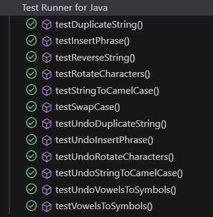
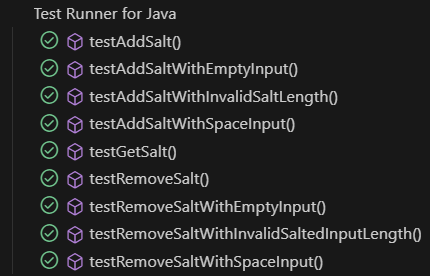
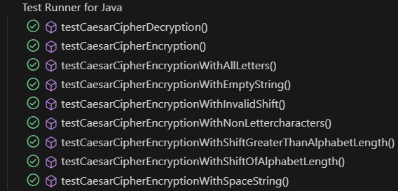
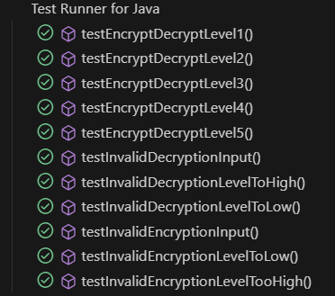
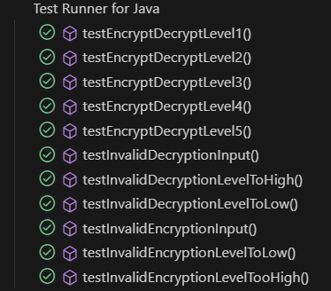

## Test Report

The following images are the results of the automated testing performed for the `StringCryption` library. 
The testing is automated using Junit 5.7.0. and all the tests are included in the repository in the [Test folder.](./src/Test/java/stringCryption/)

#### StringManipulator class

#### Salt class

#### EncryptionCipher class

#### Encryption class

#### StringCryption class

